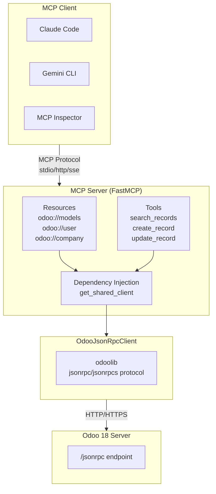

# Odoo 18 MCP Server (JSON-RPC API)

[](LICENSE)
[](https://www.python.org/)

Odoo 18 MCP Server，使用 JSON-RPC API 連線。

Based on [twtrubiks/odoo19-mcp-server](https://github.com/twtrubiks/odoo19-mcp-server), adapted for Odoo 18.

## 技術棧

- **Python**: 3.13
- **FastMCP**: >=3.0.0,<4.0.0
- **odoo-client-lib**: 2.0.1 (使用 `jsonrpc/jsonrpcs` protocol)

## 架構



## 與 Odoo 19 版本的差異

| 項目 | Odoo 19 | Odoo 18 |
|------|---------|---------|
| Record URL 格式 | `/odoo/{model}/{id}` | `/web#id={id}&model={model}&view_type=form` |
| RPC Protocol | `json2/json2s`（`/doc-bearer/`） | `jsonrpc/jsonrpcs`（`/jsonrpc`） |
| View API | `fields_view_get()` | `get_views()`（`fields_view_get` 已移除） |
| Domain operator | 支援 `any` | 不支援 `any`（用子查詢替代） |

## 環境變數

| 變數 | 說明 | 預設值 |
|------|------|--------|
| `ODOO_URL` | Odoo 伺服器 URL | `http://localhost:8069` |
| `ODOO_DATABASE` | 資料庫名稱 | `odoo` |
| `ODOO_LOGIN` | 用戶登入帳號（Email） | - |
| `ODOO_API_KEY` | API Key 認證（見下方取得方式） | - |
| `READONLY_MODE` | 唯讀模式（禁止寫入操作） | `false` |
| `VIEW_FILTERED_MODE` | View 欄位過濾模式（只回傳 UI 可見欄位） | `false` |

建立 `.env` 檔案：

```bash
cp .env.example .env
# 編輯 .env 填入你的 API Key
```

### 如何取得 API Key

**推薦：使用 Setup Wizard**（`bash setup-hr.sh`），全自動完成。

**手動方式**：
1. 登入 Odoo
2. 點擊右上角頭像 → **我的個人資料（My Profile）**
3. 切換到 **帳號安全（Account Security）** 頁籤
4. 找到 **API Keys** 區塊，點擊 **New API Key**
5. 輸入描述（例如 `MCP Server`），點擊確認
6. 複製產生的 API Key，貼到 `.env` 的 `ODOO_API_KEY` 欄位

> **注意**：API Key 只會顯示一次，請妥善保存。API Key 的權限等同於該用戶帳號的權限。

## 快速設定（Setup Wizard）

HR 等非技術人員只需執行一個指令：

```bash
bash setup-hr.sh
```

Wizard 會自動：
1. 安裝 Python 虛擬環境和依賴
2. 開啟瀏覽器選擇環境（SIT / PRD）
3. 導到 Odoo 登入頁（SAML/SSO 自動登入）
4. 點擊「Connect Claude Code」一鍵產生 API Key
5. 自動寫入 `.env` 並註冊 MCP Server

> **前提**：Odoo 上需安裝 `mcp_api_key` 模組（見下方）。

### Odoo 模組：mcp_api_key

`odoo_addons/mcp_api_key/` 提供 `/mcp/setup` 頁面，讓 SAML/SSO 用戶一鍵產生 API Key。

**安裝方式**：將 `mcp_api_key/` 複製到 Odoo addons 路徑，然後在 Odoo 後台安裝「MCP API Key Generator」。

**部署設定**：建立 `deploy-config.json`（已在 `.gitignore` 中）：
```json
{
  "environments": {
    "sit": {"name": "SIT (Testing)", "odoo_url": "https://your-sit.com/", "database": "sit-db"},
    "prd": {"name": "Production", "odoo_url": "https://your-prd.com/", "database": "prd-db"}
  },
  "defaults": {"readonly_mode": true, "view_filtered_mode": true}
}
```

## 手動安裝

```bash
pip install -r requirements.txt
```

## 啟動方式

### 開發模式（MCP Inspector）

```bash
fastmcp dev inspector odoo_mcp_server.py
```

## 傳輸模式（Transport）

| 模式 | 說明 | 適用情境 |
|------|------|----------|
| `stdio` | 標準輸入輸出（預設） | Claude Desktop、Cursor IDE、本機開發 |
| `http` | HTTP 協定 | 遠端服務、n8n、Web 應用整合 |
| `sse` | Server-Sent Events（已棄用） | 向下相容舊版 Client |

### 啟動不同模式

```bash
# stdio 模式（預設）
python odoo_mcp_server.py

# HTTP 模式
python odoo_mcp_server.py --transport http --host 0.0.0.0 --port 8000

# SSE 模式（已棄用，建議使用 HTTP）
python odoo_mcp_server.py --transport sse --host 0.0.0.0 --port 8000
```

## MCP Resources

| URI | 說明 |
|-----|------|
| `odoo://models` | 列出所有模型 |
| `odoo://model/{model_name}` | 取得模型欄位定義 |
| `odoo://record/{model_name}/{record_id}` | 取得單筆記錄 |
| `odoo://user` | 當前登入用戶資訊 |
| `odoo://company` | 當前用戶所屬公司資訊 |

## MCP Tools

| Tool | 說明 | 唯讀 |
|------|------|------|
| `list_models` | 列出/搜尋可用模型 | Yes |
| `get_fields` | 取得模型欄位定義 | Yes |
| `search_records` | 搜尋記錄 | Yes |
| `count_records` | 計數記錄 | Yes |
| `read_records` | 讀取指定 ID 記錄 | Yes |
| `create_record` | 建立記錄 | No |
| `update_record` | 更新記錄 | No |
| `delete_record` | 刪除記錄（需二次確認） | No |
| `execute_method` | 執行模型方法 | Depends |

## Claude Code MCP 設定

### 本機執行

```sh
claude mcp add odoo-mcp-server -- python odoo_mcp_server.py
```

<details>
<summary><b>手動設定 JSON（加到 <code>~/.claude.json</code>）</b></summary>

```json
{
  "mcpServers": {
    "odoo-mcp-server": {
      "command": "/bin/python",
      "args": [
        "odoo_mcp_server.py"
      ]
    }
  }
}
```

</details>

### Docker

```sh
claude mcp add odoo-mcp-server -- docker run -i --rm \
  -e ODOO_URL=https://your-odoo-server.com/ \
  -e ODOO_DATABASE=your_database_name \
  -e ODOO_LOGIN=user@company.com \
  -e ODOO_API_KEY=your_api_key_here \
  -e READONLY_MODE=true \
  -e VIEW_FILTERED_MODE=true \
  odoo18-mcp-server
```

### 雲端部署（HTTP 模式）

Docker Compose 範例：

```yaml
services:
  odoo-mcp:
    build: .
    ports:
      - "8000:8000"
    environment:
      - ODOO_URL=https://your-odoo-server.com/
      - ODOO_DATABASE=your_database_name
      - ODOO_LOGIN=user@company.com
      - ODOO_API_KEY=your_api_key_here
      - READONLY_MODE=true
      - VIEW_FILTERED_MODE=true
    command: ["python", "odoo_mcp_server.py", "--transport", "http", "--host", "0.0.0.0", "--port", "8000"]
    restart: unless-stopped
```

Client 設定：

```sh
claude mcp add --transport http odoo-mcp https://your-cloud-server.com:8000/mcp
```

## Docker 建置

```bash
docker build -t odoo18-mcp-server .
```

## 安全機制

### 唯讀模式

設定 `READONLY_MODE=true` 啟用唯讀模式，適用於生產環境查詢：

- 寫入工具（`create_record`、`update_record`、`delete_record`、`execute_method`）透過 FastMCP tags 直接隱藏，LLM 不會看到這些工具

### View 欄位過濾模式（本專案新增）

設定 `VIEW_FILTERED_MODE=true` 啟用，**適用於讓非技術人員（如 HR）安全使用 MCP 查詢 PRD 資料**。

**問題**：Odoo 的 ORM API 會回傳用戶有權限的所有欄位，即使 UI 上沒有顯示（例如薪資、個資等）。

**解決方案**：透過 `get_views()` 取得 list + form view 定義，只回傳 view 中可見的欄位。

```
一般模式:  search_records("hr.employee") → 209 個欄位（含薪資、個資）
View 過濾: search_records("hr.employee") → 138 個欄位（只有 view 上顯示的）
```

**運作方式**：
1. 首次查詢某個 model 時，呼叫 `get_views()` 一次取得 list + form view
2. 從 `models` 回傳取得該用戶可見的欄位定義（已過濾 groups）
3. 從 arch XML 解析 `<field>` 名稱作為補充
4. 合併欄位集合並快取，所有讀取操作只回傳這些欄位
5. 即使 LLM 嘗試指定不在 view 中的欄位，也會被過濾掉

**建議 HR 使用的設定**（`.env`）：
```bash
ODOO_URL=https://your-odoo-server.com/
ODOO_DATABASE=your_database_name
ODOO_LOGIN=hr_user@company.com
ODOO_API_KEY=hr_user_api_key_here
READONLY_MODE=true          # 禁止寫入
VIEW_FILTERED_MODE=true     # 只看 view 可見欄位
```

### 刪除二次確認

`delete_record` 內建 confirm 機制，LLM 必須先以 `confirm=False` 呼叫取得確認提示，經使用者同意後才能以 `confirm=True` 執行刪除。

## 健康檢查

HTTP/SSE transport 模式下提供 `/health` 端點：

```bash
curl http://localhost:8000/health
# {"status": "healthy", "service": "odoo18-mcp-server", "version": "1.0.0"}
```

## 測試

```bash
pip install -r requirements-dev.txt
pytest tests/
```

## Credits

Based on [twtrubiks/odoo19-mcp-server](https://github.com/twtrubiks/odoo19-mcp-server) by [@twtrubiks](https://github.com/twtrubiks).

## License

Apache 2.0
